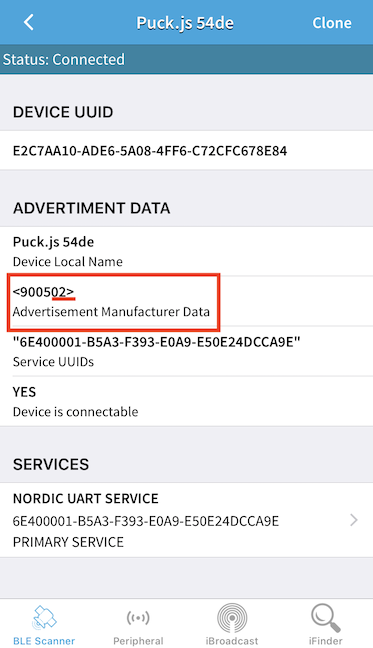

# BLE pushbutton with counter

When working with Bluetooth Low Energy (BLE) the two core concepts are General Access Profile (GAP) and GATT (Generic Attribute Profile). In this project, we are going to use GAP which is the simpler of the two. GAP only provides one-way communication and is typically used for making a device visible which in BLE terms is called advertising.

There are two ways to send advertising out with GAP. The Advertising Data payload and the Scan Response payload.

There are two main types of advertising:

* Services - each Service has a Service UUID
* Manufacturer Data, Espruino/Puck.js has its own 16 bit UUID reserved (0x0590), which you can use for whatever use you want

When the button is pressed we increment a counter and utilize the 16 bit UUID, we have a byte at our disposal. So we can make a counter that goes up to 255, when it hits 255 we set it to 0.

If we press the button twice it will look like this in a BLE scanner app:

The code can be found in the [/src](https://github.com/HiMinds/himinds-iot-project-embedded-sensor-pushbutton-ble/tree/master/puckjs-code/src) directory.

This project is based on the following code:  [BLE Advertising with Node.js/Python/C#/Android](http://www.espruino.com/Puck.js+Advertising)
